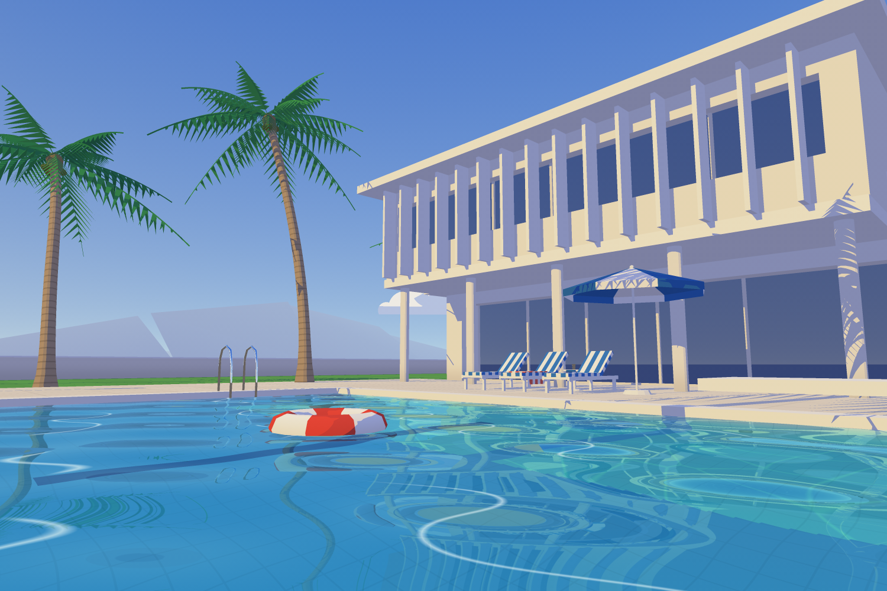
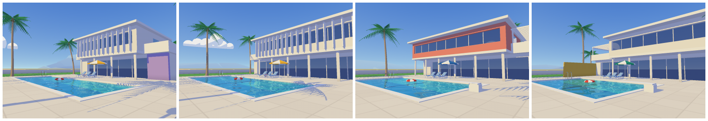

# Vacant Sunlight

A from-scratch software 3D renderer that paints a procedurally grown seaside villa as flat, sunlit illustrations, in homage to the poolside paintings of Hiroshi Nagai. It comes with an interactive viewer and a short picture book, *Someone Was Just Here*, set at one house over one summer day.



- **Interactive viewer:** [`docs/index.html`](docs/index.html). One self-contained 76 KB file. Drag to orbit, grab the sun to move it along its real path, and step through seeds.
- **Picture book:** [`docs/book.html`](docs/book.html). Eight pages, one day, nobody in any of the pictures.
- **The idea behind it:** [`PHILOSOPHY.md`](PHILOSOPHY.md).

No images, textures, models or rendering libraries are used. Every pixel comes from the code in `src/`.

## The book

Each page is the same world (seed 1981) seen at a different hour. The story is carried by what moves between pages: a towel and a book arrive and leave, the umbrella opens and closes, the float drifts from the deep end to the shallow end, and by night the car is gone.

| | | | |
|---|---|---|---|
|  |  |  |  |
| 6:50 a.m. | 9:00 a.m. | 11:24 a.m. | 1:00 p.m. |
|  |  |  |  |
| 3:12 p.m. | 6:15 p.m. | 7:45 p.m. | 9:45 p.m. |

## One view, one day

The sun follows its actual path over 34° north in late July. Sky colors, shadow direction and length, sea glitter, window light and pool light all follow from the hour.


## One rulebook, many houses

Each seed grows a different villa from the same rules: facade width and depth, whether the upper floor cantilevers (and the columns that carry it), an accent (a colored volume, wall or stair tower), and a shadow-making feature (a pergola or fins). The pool is sized to the facade, and palms are placed by rejection sampling around everything else.



## How it works

**Rasterizer** (`src/raster.js`). Triangles are clipped against the near plane and rasterized row by row with edge functions into a *visibility buffer*: for each sample, the nearest triangle's id and depth. Shading runs afterwards, exactly once per visible sample, so overdraw costs almost nothing. Frames render in 64-pixel tiles with supersampling (9 samples per pixel for the book).

**Flat color as a lighting model** (`src/sky.js`, `src/render.js`). Each moment of the day names a *light tone* and a *shade tone* directly, the way an illustrator would. Keyframes are indexed by solar elevation. A flat face is its local color times one or the other. Curved things (palm trunks, columns, the car) get toon bands. Shadows read as periwinkle and violet rather than gray.

**Shadows** (`src/bvh.js`). The viewer uses a 2048² sun shadow map fitted to the property. For print, the map only *classifies*: where a 4×4 texel neighborhood agrees, its answer stands, and everywhere else a ray is traced through a bounding volume hierarchy. That gives exact, crisp edges at a fraction of the cost of tracing every sample. A test checks the hybrid against pure ray tracing, and doing so exposed a silent node-array overflow in the first BVH.

**Water.** The pool surface has an analytic ripple field. Refraction is solved by intersecting the bent ray with the tiled basin, with per-channel absorption along the path. Reflections come from a second render through a camera mirrored in the water plane, looked up along the ripple-perturbed reflected ray. A stylized Fresnel term blends the two. On top sit caustics on the floor and wavy light lines along the ripple crests. At night the underwater lights take over.

**Sky and sea.** Gradient skies with a sun-side horizon tint, stylized flat-bottomed clouds on the sky dome (so they also appear in every reflection), stars, a moon, and an analytic sea with swell lines, a glitter path under a low sun, and haze into the horizon.

**World** (`src/world/`). A transform-stack mesh builder with boxes, prisms (ear-clipping triangulation), extruded profiles, tubes with parallel-transport frames, and spheres. The builder feeds the villa rules, the palm generator (trunks bend as t^1.8, fronds are ballistic arcs with folded leaflets), and the props. Independent random streams per subsystem mean the story props never reshuffle the house.

**Viewer** (`web/`). While you move it shows a quick low-resolution preview, then refines to full resolution and then 2× supersampling, tile by tile from the center out. Dragging the sun solves for the hour whose projected sun position is nearest the cursor. The UI follows the algorithmic-art viewer template, with the renderer in place of p5.js.

## Running it

Node 22 or newer. `npm install` brings in esbuild, which is used only to bundle the viewer into one file.

```sh
npm test                 # math, rasterizer coverage, BVH vs brute force, PNG round-trip, solar model, world rules
npm run build            # docs/index.html (the viewer)
npm run book             # renders the book into docs/book/ and docs/book.html (about a minute)
npm run gallery          # the two contact sheets above
npm run render -- --view sea --time 18.25 --w 1500 --h 1000 --ss 3 --out sunset.png
```

`node scripts/book.js --inline book.html` writes a single self-contained copy of the book with the images embedded.

On one CPU core, a 1500×1000 book page with 9 samples per pixel and traced shadows takes about 4–9 seconds, and the whole book about a minute. The world has about 23,000 triangles.

## Notes

- The style is an homage. No artwork was copied or used as input; the look comes from rules written in code.
- The renderer is single-threaded. The viewer stays responsive by rendering previews at reduced resolution and refining in small time slices.
- `PHILOSOPHY.md` is the brief the engine was built against.
