# Paloma Bay

*A seaside town painted by a from-scratch software renderer, one picture at a time.*

A motel on the coast highway, a boulevard laid out on the midsummer sunset, a beach with a lifeguard tower and a pier, a house on the point, and a marina with a lighthouse. It's all grown from rules and painted by an engine written for this project, in homage to the sunlit, deserted resort paintings of Hiroshi Nagai. No images, textures, models or rendering libraries are used. Every pixel comes from the code in `src/`. The town can be painted in two looks, [Pastel and Cobalt](#two-looks).

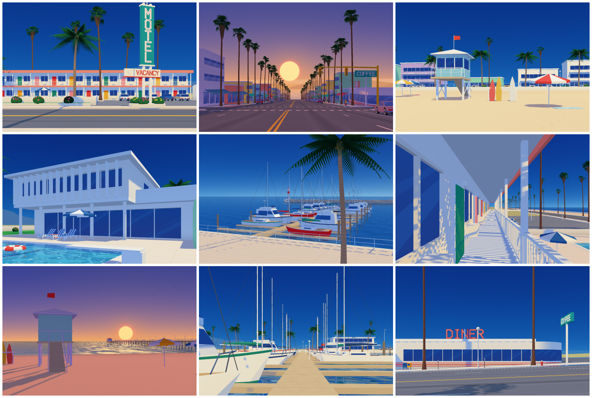

- **Visit the town:** [`docs/index.html`](docs/index.html) ([live](https://patelnilay251.github.io/musical-bassoon/docs/)). Full screen, one picture at a time, nothing else on it. Drag across the painting to pass the day. `←` `→` go to another place and `↑` `↓` to another view of it; on a phone, tap the edges or flick up and down. `Space` lets the day go by on its own, and `L` (or the switch in the corner) turns the town to the other look. The page opens wherever the visitor happens to be at your local time, in the look you chose last.
- **Walk the town:** [`docs/live.html`](docs/live.html) ([live](https://patelnilay251.github.io/musical-bassoon/docs/live.html)). All five places, painted live on your graphics chip by the same rules, in either look. Click and walk with `W` `A` `S` `D` (`shift` to run) and look around with the mouse. Climb the motel stairs to the walkway, walk down the boulevard to the sea, go up the gangway from the docks to the quay. `1` to `5` (or the names at the top) take you to another place, `[` `]` or the wheel change the hour, and `space` lets the day pass. It needs WebGPU: Chrome, Edge, or Safari 26 and later.
- **The book:** [`docs/book.html`](docs/book.html). *Wish You Were Here*: ten postcards from one summer day, sent by someone who never appears in any of them, in either look.
- **The film:** [`docs/day.html`](docs/day.html) ([live](https://patelnilay251.github.io/musical-bassoon/docs/day.html)). *One Day in Paloma Bay*: three minutes of one summer day, passing through every postcard in the book, with its own score. The 1080p master is on the [releases page](https://github.com/patelnilay251/musical-bassoon/releases/tag/render-day-final).
- **The arcade version:** [`docs/film.html`](docs/film.html) ([live](https://patelnilay251.github.io/musical-bassoon/docs/film.html)). *Paloma Bay, the attract mode*: 86 seconds of an arcade game from a summer that never happened, with its own music.
- **The workshop:** [`docs/workshop.html`](docs/workshop.html). The first viewer, with all its knobs, for the house alone.
- **The idea behind it:** [`PHILOSOPHY.md`](PHILOSOPHY.md).

## Two looks

The same town under the same sun, painted two ways. A look is only data (`src/looks.js`): the sky's colors hour by hour and how they are sprayed, the clouds, how shade is mixed, the veil of distance, the pools, a few colors of the ground and the palms, the flowers and the grain. Every place, picture and film can be painted in either. The site, the book and the workshop each have a switch, and the town and the book remember the choice between visits.

| Pastel | Cobalt |
|---|---|
| 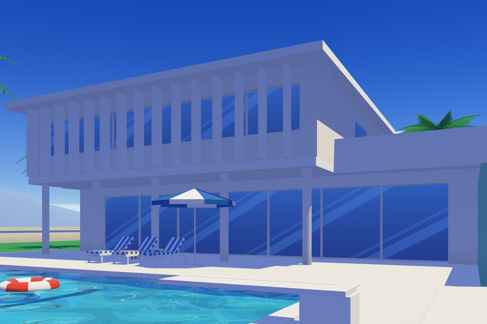 | 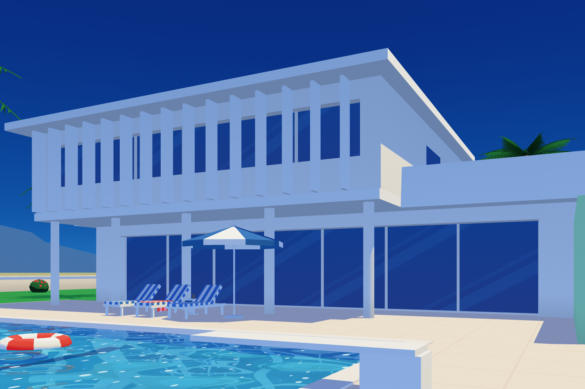 |
| 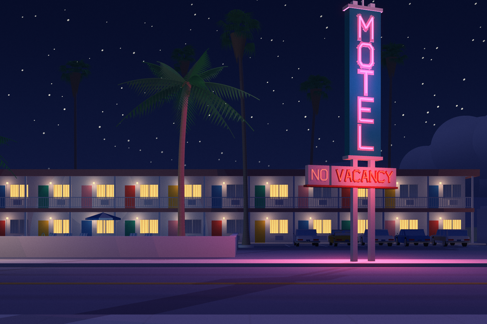 | 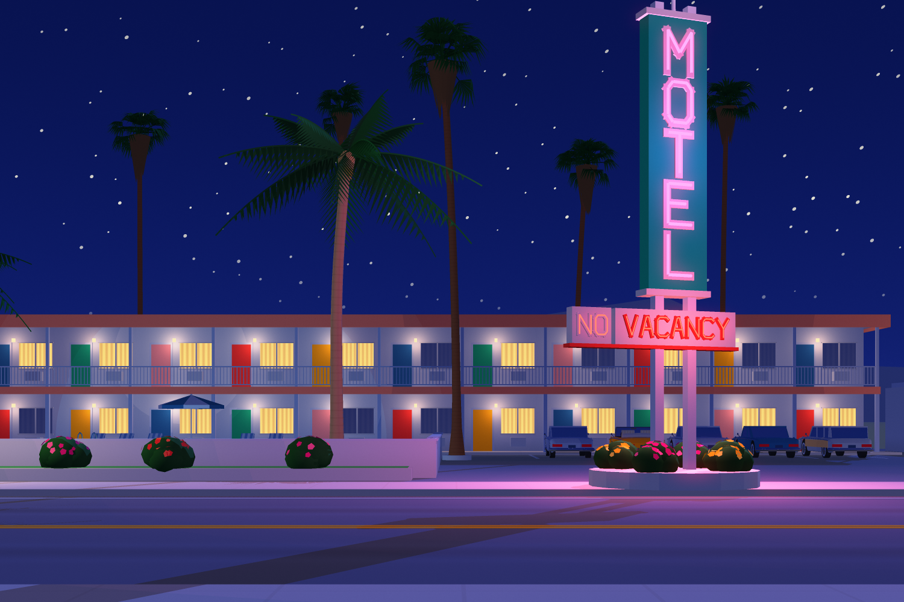 |

- **Pastel** is the first look, an airbrushed summer. The sky is misted white at the horizon and piled with cumulus. A face in shadow is its own color under the blue shade light, a veil of air lies over the distance, and a fine grain lies over everything like the tooth of acrylic sprayed on board. Both films were painted in it and keep it.
- **Cobalt** is the repaint, made after measuring record covers of the period against our own pictures. The sky is a deep cobalt right down to the horizon, with hardly a cloud, and the night a luminous royal blue. Shade is mixed the way a painter mixes it, and the paint is crisp. Palms are dark with bright tips, the sun is dabbed on the pools in flecks, and flowering bushes add spots of hot color. The site opens in it.

Both are kept exactly: painted in Pastel, every picture is identical, bit for bit, to what the engine made before the repaint, and every picture in Cobalt is identical to the repaint's.

## The visitor

Nobody appears anywhere in town. Someone is visiting, though, and they keep a schedule (`src/visitor.js`). The motel at night. Breakfast at the diner. A morning at the house on the point, with a towel, a book and a glass left by the pool. An afternoon on the beach, with an umbrella over nobody and a surfboard missing from the rack, then back again on the sand. At six the red sloop's slip at the marina is empty. The site and the book read the same schedule. Scrub the day on the site and you can follow the yellow convertible around town.

## Wish You Were Here

| | | | | |
|---|---|---|---|---|
| 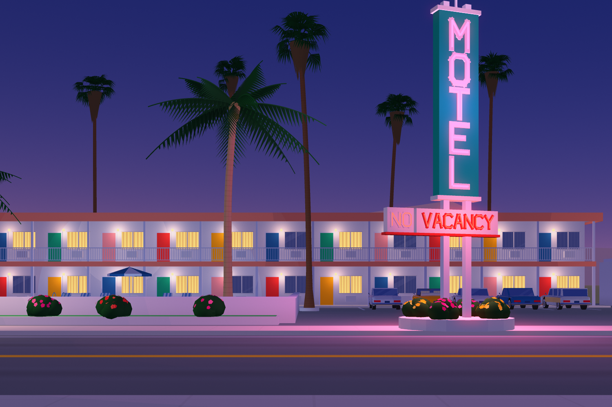 | 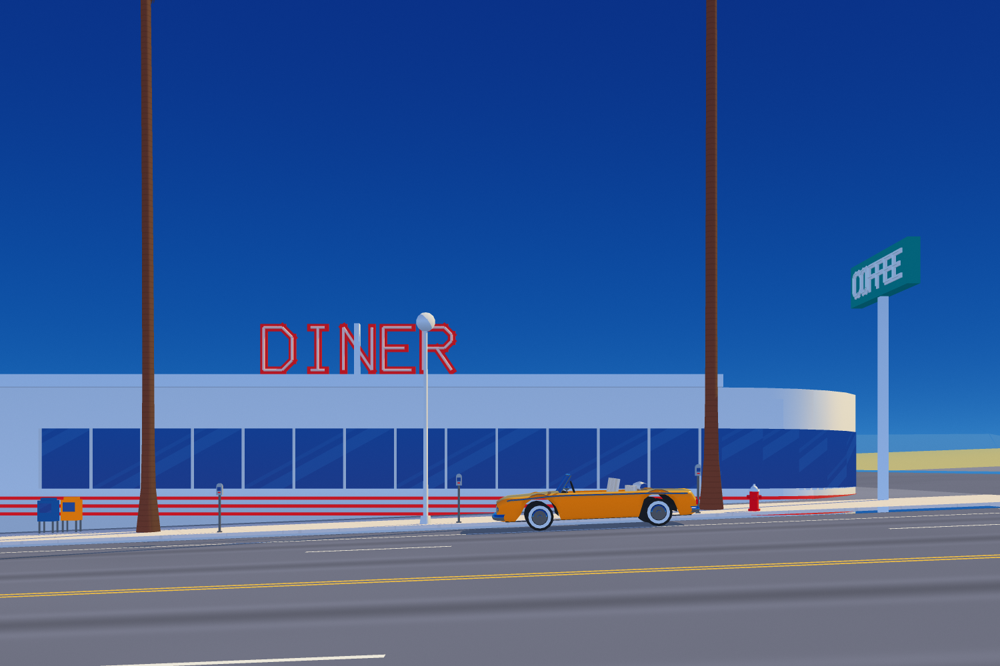 | 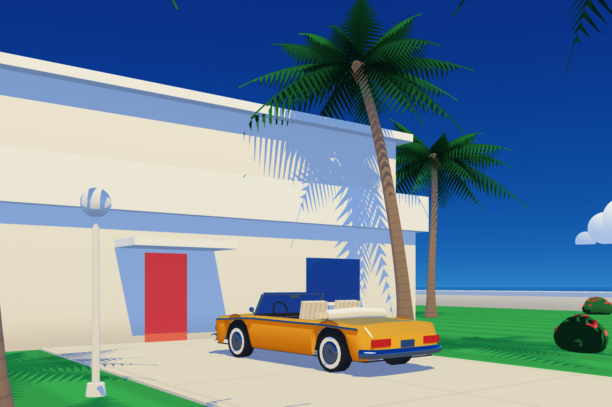 |  | 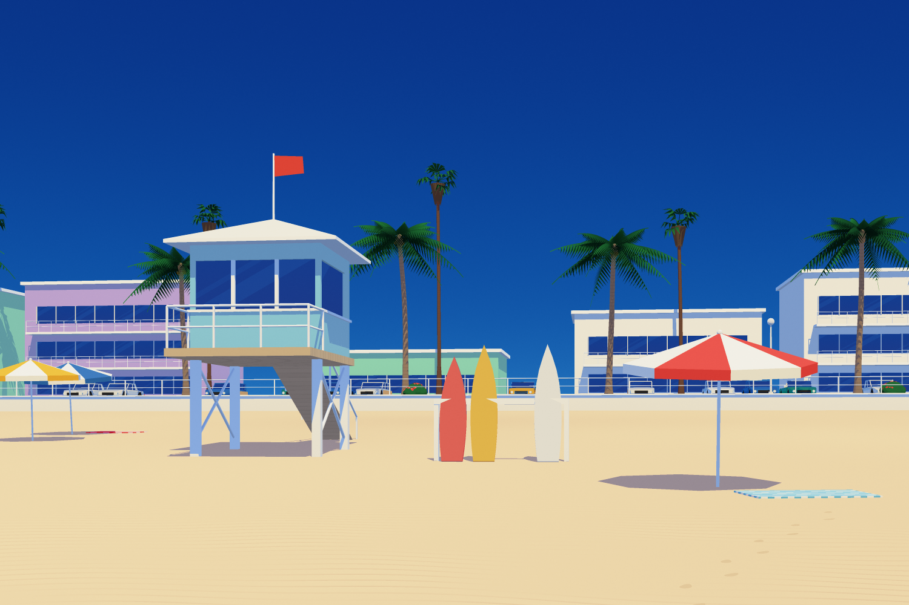 |
| 4:51 a.m. | 8:18 a.m. | 9:48 a.m. | 11:36 a.m. | 2:12 p.m. |
| 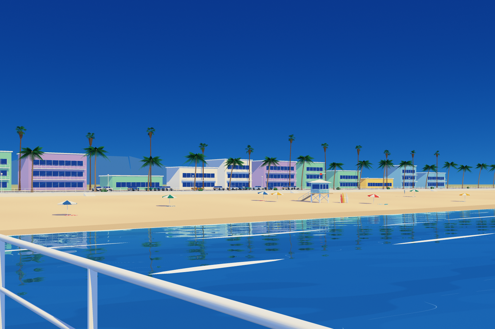 | 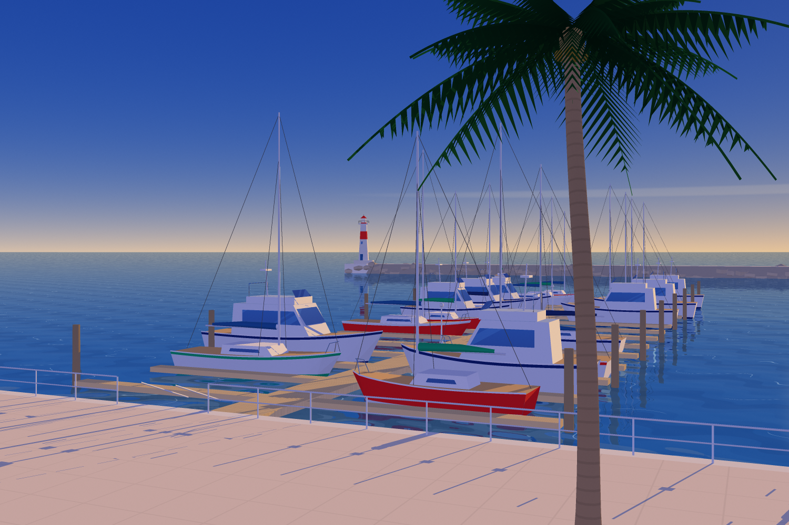 | 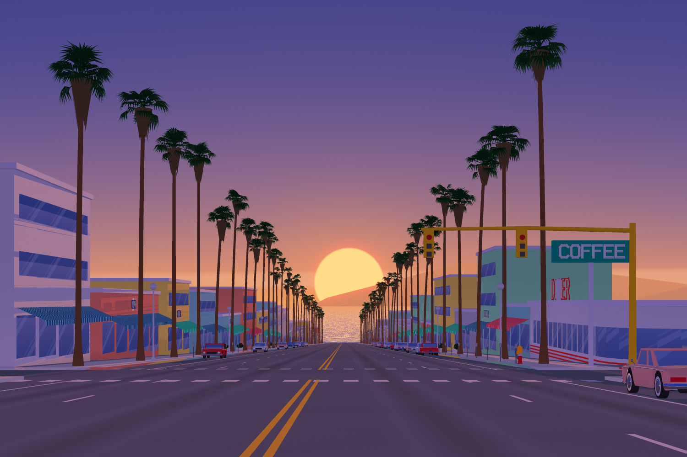 | 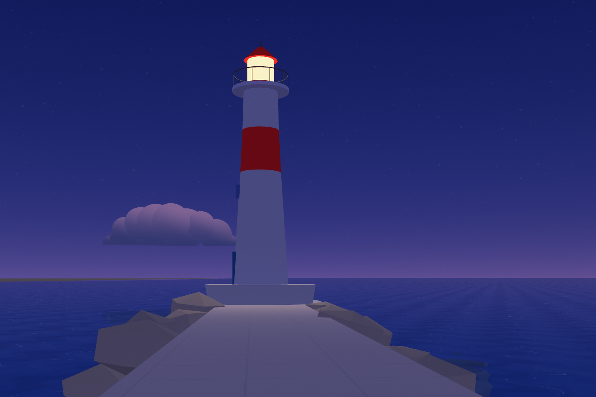 |  |
| 4:12 p.m. | 6:06 p.m. | 6:48 p.m. | 7:27 p.m. | 10:00 p.m. |

## One place, one day

The sun follows its real path over 34° north in late July. The palette, the shadows, the sea glitter and the lights all follow from the hour. Neon burns until sunrise, and the NO in NO VACANCY comes on when the visitor gets back for the night.

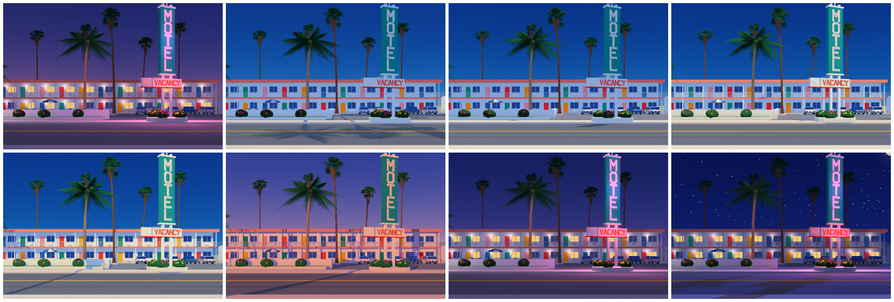

The same day in Pastel is in [`docs/gallery/pastel/`](docs/gallery/pastel/day.png), with the rest of the contact sheets.

## One Day in Paloma Bay

[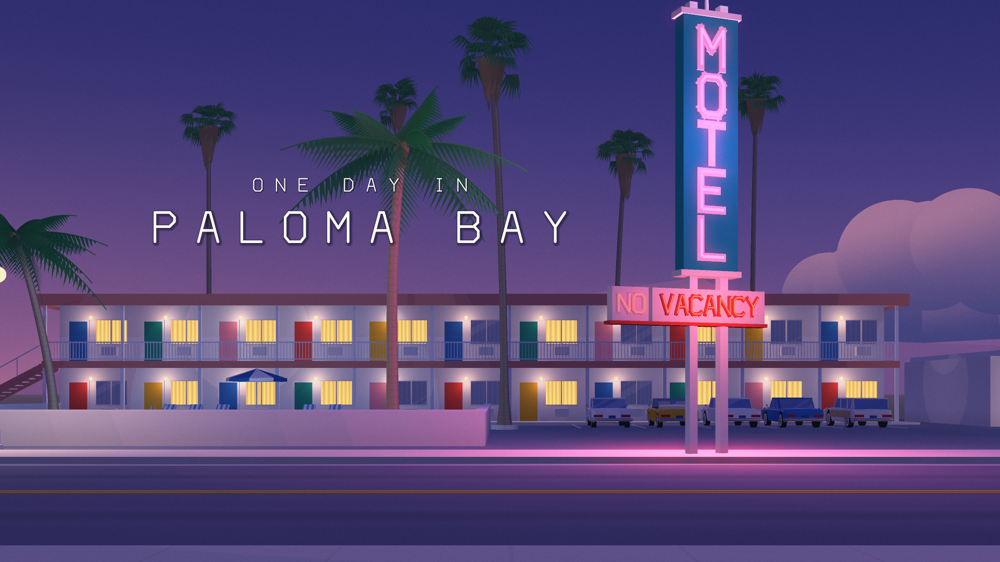](docs/day.html)

One summer day, from before dawn at the motel to the last room going, told only through light and the things a visitor leaves behind. The visitor is never seen. There are thirteen shots, and the film passes through every postcard in the book: at each card's minute the frame is exactly that page, and a caption in the town's own sign lettering says where and when.

- **Two clocks** (`film/day/score.js`). The light runs fifty to a hundred times fast, so each shot covers ten to twenty minutes of the day and you watch shadows creep and the sky turn. Wind, water, birds and the car run in real time. The camera stays level and mostly still. It pans with the car as it pulls in at the diner and again as it comes home, and it pushes slowly down the boulevard at sunset. The moving car is filmed with a 180° shutter: four exposures across half a frame, averaged.
- **The traces.** The yellow convertible arrives at breakfast and parks where the postcard shows it. Footprints run from the towel to the water, and back once the surfboard is returned. The red sloop comes home past the lighthouse at dusk. At night the visitor's window lights up after the car door closes, and the NO in NO VACANCY buzzes on.
- **The car radio** (`film/day/radio.js`). The visitor exists only through their car, and the car plays the attract mode's song, that summer's hit, through its dashboard speaker. It is heard getting nearer, and it stops dead mid-phrase when the key turns, once at breakfast and once at night. The score (`film/day/music.js`) is the same tune as a 76 bpm ballad on electric piano, pads, a fretless bass, brushes and a soft FM horn. It enters at the pool, lifts a key as the sun touches the sea at the end of the boulevard, and rings a bell on each flash of the lighthouse. At the end it finishes the phrase the radio broke off, and a music box plays the tune once more.
- **The sound of each place** (`src/audio/fx.js`, `film/day/sfx.js`). Every sound is synthesized. Before dawn: crickets, the sign's hum, a truck far up the highway, the ice machine by the office. At sunrise: doves and a mockingbird. On the beach: surf in step with the breakers on screen, the tower flag and its halyard ringing on the pole, pelican wings. Then pilings and creaking planks under the pier, halyards and fenders at the marina, a bell buoy, waves on the rocks and a foghorn. Each place is heard a moment before it is seen, and every source sits where the camera sees it.
- **What the engine learned for it.** A new convertible, lofted from cross-sections, with whitewalls, chrome and pleated seats. Painted ground: wind ripples in the sand, mowing stripes, and lanes worn into the asphalt. Curtains drawn in lit motel rooms, parking meters and hydrants along the boulevard, stars that shimmer and umbrellas that breathe in the wind.

## The attract mode

[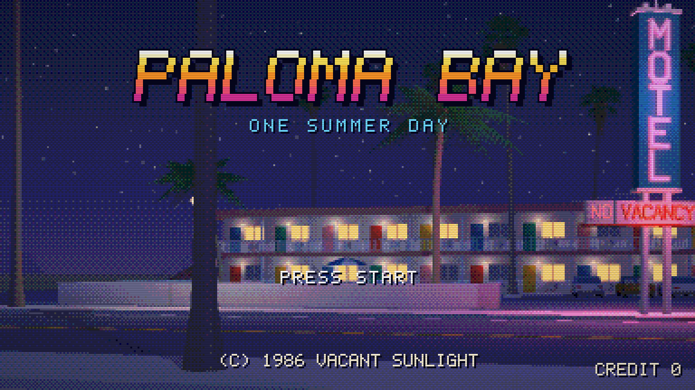](docs/film.html)

The town, filmed as the arcade game its summer would have had, playing itself between customers. Somebody drops in a coin and presses start, and the game plays one day as the visitor. It starts before dawn at the motel with the sun coming up over the hills. Then the yellow convertible drives down the boulevard to the diner, with the speedometer running. After that come a morning at the house, the surf at the beach, and the red sloop motoring out of the marina and getting its sails up. The camera glides down the boulevard as the sun sets at the end of it and the street lamps catch. At night the car comes home to its stall, the NO in NO VACANCY buzzes on, and the caption types itself out: WISH YOU WERE HERE. INSERT COIN.

- **Everything moves.** Each frame builds the place as it stands at that instant (`src/world/motion.js`): fronds sway in the onshore wind, boats heave and pitch on the swell, breakers surge in and the swash runs up the sand, the tower's flag flutters, gulls cross the sky. The car and the sloop follow paths with speed profiles (`film/attract/score.js`). At rest, for the stills, nothing moves.
- **The look of the hardware** (`src/retro.js`, `src/pixelfont.js`, `film/attract/screen.js`). The engine paints each frame at 384×216. It is reduced to 512 colors (three bits a channel) with a 4×4 ordered dither and enlarged four times with hard pixels and scanlines. The HUD, the stage cards and the logo are drawn in a 5×7 board font. Stages change the way consoles changed them: the picture breaks into blocks and fades in steps. Quiet scenes are animated on twos, 15 pictures a second; the two drives run at 30.
- **The sound** (`src/audio/synth.js`, `film/attract/music.js`, `film/attract/sfx.js`). An original tune in D in the city-pop manner is played on a small FM synthesizer written for it. It uses rootless ninth chords and the royal road progression (IV–V–iii–vi), with the last chorus a whole step up for the sunset. Every effect is synthesized and placed from the same score as the pictures. The surf breaks when the lines on screen do, the engine's revs follow the car's speed, the door closes after the car has parked, and the neon clicks on frame by frame.

## Painted, not rendered

The first version rendered a resort. This one tries to paint a town, the way an illustrator with an airbrush would:

- **Light is chosen, not simulated.** Each moment of the day names a light tone and a shade tone, keyed to the sun's elevation. Planes take one of three lit values (full, oblique, grazing) instead of a continuous falloff, and curved forms get a soft terminator and a sprayed sheen.
- **Shade is a color.** In Pastel a face in shadow is its own color under the shade tone, so shadows are a change of hue, not a loss of it. Cobalt mixes shade instead of graying it. A color keeps its own hue, deeper and richer: a pink wall goes coral, a lawn deep green. Only whites and grays take the sky's cerulean. Shadows cast on the ground are deeper than walls in shade. Foliage is painted as dark masses with the sunlit leaves picked out bright, and palm fronds darken toward the crown and brighten toward their tips.
- **Skies are sprayed by hand.** A blue ground goes down first, then the horizon's tone sprayed up from below, then blue back over it toward the zenith, never perfectly even. Clouds are crowns of puffs lit as one airbrushed form. Pastel's horizon is misted white and its cumulus stand high. Cobalt stays a deep, saturated cobalt right down to the horizon and has two clouds at most, low on it. There, thin streaks appear only when the sun is low, and nights are a luminous royal blue, not black.
- **Glass and water are painted the way painters paint them.** Windows get deep blue at the foot of each floor, lifting toward the sky's color, with diagonal bands of reflected light. Water mirrors the world through a second camera, then gets marbled bands and broken white crest lines. Beaches fade from aqua over the sand to deep blue offshore, with foam drawn as tapered strokes. Cobalt's pools are azure, and the sun on their ripples is dabbed on as a mosaic of small bright flecks.
- **Hot color where the picture needs it.** In Cobalt, bougainvillea, hibiscus, oleander and lantana grow along the pool walls, around the foot of the motel sign, in planters on the boulevard and at the feet of the promenade palms (`src/world/plants.js`). They are dark green mounds studded with blossoms. Decks and sidewalks are a warm pink-cream.
- **Verticals stay vertical.** Every composition is built level, like a view camera, and a lens shift puts the horizon where the picture wants it (`src/camera.js`). Taller screens keep the width of the view and gain sky. Long lenses flatten the perspective.
- **Finish:** neon and lamps burn past white, and a glow pass lets them bleed. Distance lays a veil of the horizon's color over things. It is heavier in Pastel, and in Cobalt faint, so distant things stay crisp. Pastel gets a fine grain, strongest in the midtones so whites stay clean. Cobalt gets only a faint dither that keeps its deep gradients from banding: acrylic sprayed smooth.

## Walking the town

The painted town makes one picture at a time on the processor. The live town (`src/live/`) paints the same places on the graphics chip about sixty times a second, so you can walk through them. The rules are the same ones, written again as shaders (`src/live/wgsl.js`): the sky and the sea, the three painted values, each look's shade, the patterns, the glass and lit rooms, the pools and the harbor with their mirrored worlds, the pools of lamplight, the glow and the grain. A live frame and a painted one of the same view are within a level or two of 255 on average, apart from the edges of things.

- **The camera stays level**, as in the paintings. Looking up or down slides the frame, like the rising front of a view camera, so the motel's posts and the palms stay vertical.
- **Walking** (`src/live/walk.js`) reads the place's own triangles into a grid of 25 cm cells (a little coarser on the long boulevard): where the floors are, what stands in the way, and where the water is. You can step up a curb, climb a stair or a gangway, but not walk through a wall, and you never stand below the water. Each walk starts where the place's hero picture is taken. The marina is the exception: its hero picture is taken from the yacht club's terrace, which has no stairs down, so the walk starts at the end of a dock.
- **Back faces are culled, as the painter does.** Open water is one sheet seen from above. The mirrored camera sees it from below, and it must not paint over the boats reflected in it.
- **Big triangles are cut small near the camera.** The highway and its painted lines run for twelve kilometers. Across a triangle that size a GPU sets up depth too coarsely where it passes the camera, and lines laid a centimeter above the asphalt sink under it.

### Up close

A painting never has to show what a walker sees at arm's length, so the live town adds it. None of it reaches the painted town: the shaders' additions fade out by thirty meters, and the geometry is added to a finished world (`src/live/detail.js`), never built into it.

- **A second shadow map follows the walker.** It is 40 m across at a centimeter a texel, read with nine taps. The whole-box map is ten centimeters a texel on the boulevard. Where the sun grazes a wall, the lookup is pushed further off the face and read wider, and the grazing light comes in over the first few degrees, so a low sun along a wall doesn't paint it in teeth.
- **Grain, by material:**
  - sprayed stucco on the walls;
  - stones in the asphalt, with sealed cracks that wander;
  - concrete speckle, and each slab poured a shade of its own;
  - fibers up the palm trunks;
  - sand;
  - wood grain along the boards;
  - blades of grass;
  - clusters of leaves on the hedges and bushes, in a noise that runs all the way round.

  Every octave fades before a pixel is a third of its size, so nothing shimmers.
- **Rooms behind the glass.** Interior mapping: each pane opens onto a room that is not there. The ray from the eye goes on past the glass to the room's back wall, a side wall, the floor or the ceiling, and meets what stands in the room.
  - Motel rooms have curtains and a bed.
  - The boulevard has three kinds of shop: shelves of goods and a counter, a café with a menu board and tables, and a boutique with clothes on a rail.
  - Elsewhere there is a sofa and a picture of the sea.

  By day the painted glass lies over the room as a reflection would, and lightens it. After dark the lit rooms glow, and their lamps light what is in them.
- **Hardware and framing.** The motel doors have brass knobs, kick plates and room numbers, 101 up along the ground floor and 201 up along the walkway, lettered in the town's sign font. The big panes of the shops and lounges are framed with mullions and transoms.

## How it works

**Rasterizer** (`src/raster.js`). Triangles are clipped against the near plane and rasterized with edge functions into a visibility buffer: for each sample, the nearest triangle's id and depth. Shading runs once per visible sample, afterwards, so overdraw is nearly free. Frames render in 64-pixel tiles with supersampling.

**Shadows** (`src/bvh.js`). An orthographic sun shadow map, read with PCF. For print, the map only classifies: where a 4×4 neighborhood agrees, its answer stands, and everywhere else a ray is traced through a bounding volume hierarchy, which gives exact edges for a fraction of the cost.

**Reflections.** Everything above the water is rendered a second time from a camera mirrored in its surface, then looked up along the ripple-perturbed reflected ray. Pools limit that pass to their rectangle. For open water under a level camera, row *y* of the frame only ever sees mirrored row *−y − 2·shift*. So only a band of the mirror is rendered, and a test proves the picture doesn't change by a single bit.

**The town** (`src/scenes/`, `src/world/`). A transform-stack mesh builder (boxes, prisms, extruded profiles, tubes, spheres) feeds the rules for each place:
- a motel block with walkways, pickets and colored doors;
- a pylon sign with stacked channel letters in a stroke font, neon laid in every stroke;
- Mexican fan palms with skirts and split, drooping fan leaves, and coconut palms with folded leaflets;
- cars in three bodies;
- hulls lofted from stations, with sheer, flare and overhangs, then rigged as sloops or built up into motor yachts;
- a lighthouse, a rock breakwater, a pier on pilings, a lifeguard tower, and a streamline diner with a rounded end.

The boulevard is built in a road frame and turned onto the sunset bearing. Every place has a fixed seed and independent random streams, so the things the visitor leaves behind never reshuffle the town.

**The site** (`web/`). The whole engine is bundled into a Web Worker and inlined into one HTML file. A pool of workers paints each frame from the middle out. While you drag, it's a quick sketch at a fraction of the resolution. Once you let go, the finished picture comes in tile by tile over the sketch, and the glow is laid on at the end. Places crossfade. Without workers, the same service runs on the page one tile per task.

## Running it

Node 22 or newer. `npm install` brings in esbuild, which is used only to bundle the site.

```sh
npm test                 # engine, world rules, the town, the visitor, the lens, the mirror band, the render service, both films, the live town
npm run build            # docs/index.html (the town), docs/live.html (the live town) and docs/workshop.html (the old viewer)
npm run book             # the postcards in both looks, in parallel on every core, into docs/book/<look>/ and docs/book.html
npm run gallery          # the contact sheets above, in both looks, into docs/gallery/<look>/
npm run film -- --film day   # One Day in Paloma Bay, its poster and docs/day.html (needs ffmpeg)
npm run film                 # the attract mode, its poster and docs/film.html
npm run render -- --place marina --view slips --time 15.8 --w 1500 --h 1000 --ss 3 --rays --look pastel --out docks.png
```

`--looks pastel` (book, gallery) renders only some of the looks, and `--look` picks the one for a still (Cobalt unless told) or a film. Each film keeps Pastel, the look it was painted in, unless it is given another.

Films are streamed frame by frame, in order, into ffmpeg (on the `PATH`, or named by `FFMPEG`); every frame is built and painted from scratch. `--draft` makes a quick low-resolution cut, `--from 57.6 --to 67.2` renders a stretch, and `--audio-only` just the soundtrack, which takes ten to twenty seconds. The attract mode takes about seven minutes on four cores. It is 1536×864 because at four times enlargement each board pixel fills exactly one of H.264's 4×4 blocks, which keeps the pixels hard and the file small.

*One Day* is 4,396 frames at 1920×1080 with four samples a pixel and exact shadows, several hours on four cores, so it renders on GitHub Actions instead (`.github/workflows/render.yml`). Committing a change to `render/request.json` (which film, draft or final, how many slices) starts twenty runners. Each renders a slice with `--slice k/20 --video-only`, and a last job joins the slices without re-encoding (`--join`), lays the soundtrack under them, and posts the film to a pre-release named after it. The draft takes about three minutes and the final about half an hour.

`node scripts/book.js --inline book.html --look pastel` writes a single self-contained copy of the book in one look, with the images embedded. A 1500×1000 postcard with 9 samples per pixel and exact shadows takes 8 to 22 seconds on one core, and the whole book in both looks about 80 seconds on four.

## Notes

- The style is an homage. No artwork was copied or used as input to the program; both looks come from rules written in code. Cobalt's palette and rules were tuned by studying published record covers next to our own pictures and measuring the difference (sky gradients, saturation, the color of shade).
- Geometry ranges from about 35,000 triangles (the house, in Pastel) to 240,000 (the boulevard in Cobalt, which has 128 palms, a parking meter for every space, a dozen cars and planters of flowers on it).
- The film's game, its company and its copyright line are fictional.
- `PHILOSOPHY.md` is the brief the engine was built against.
