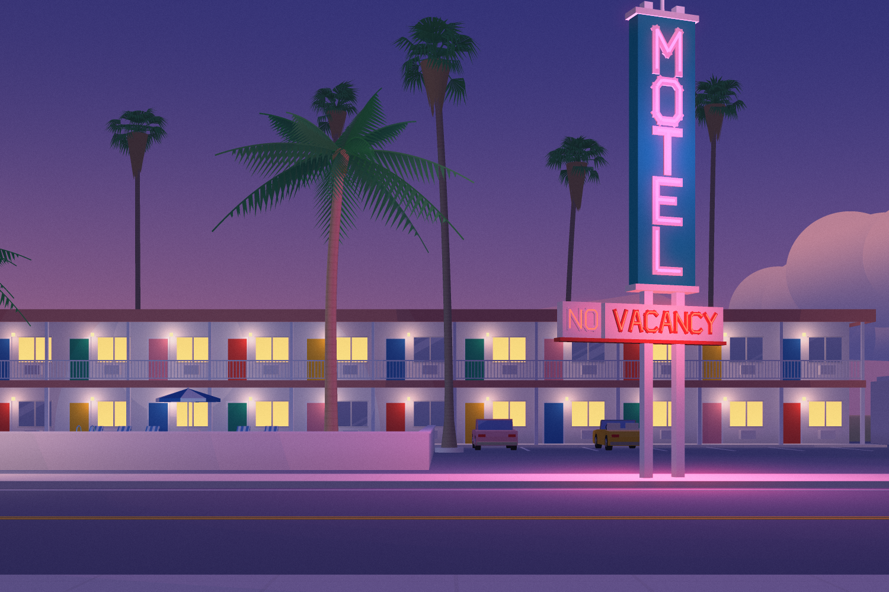
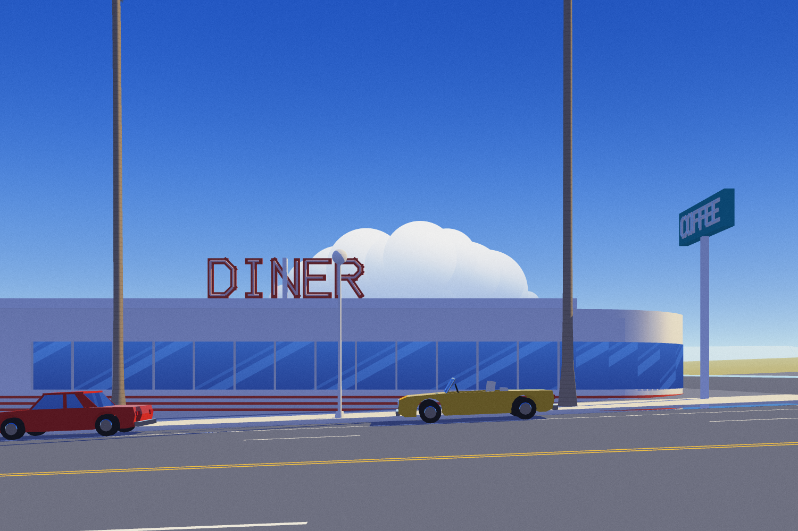
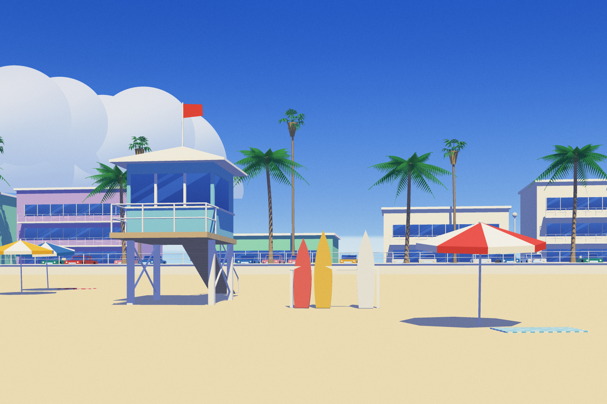
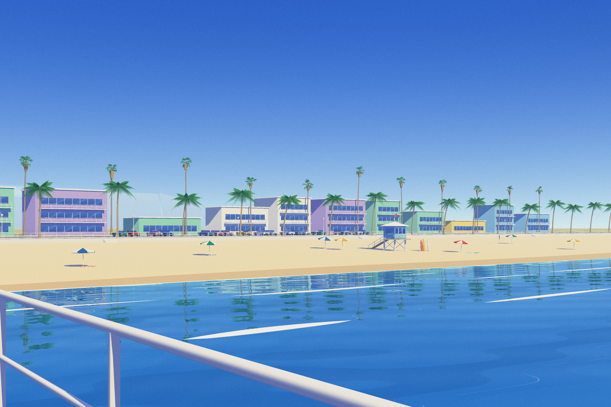
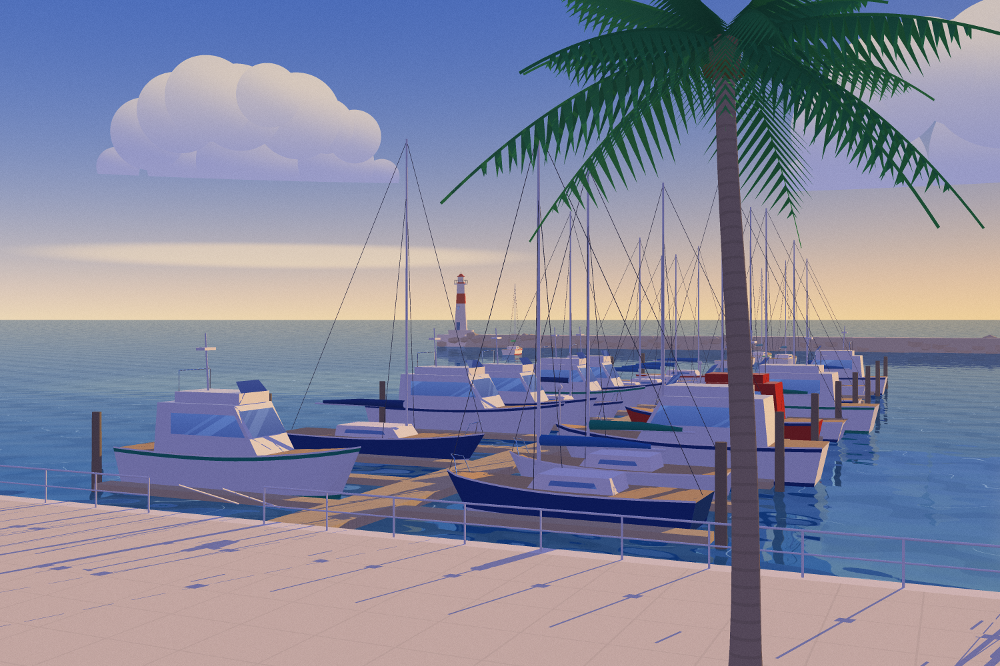
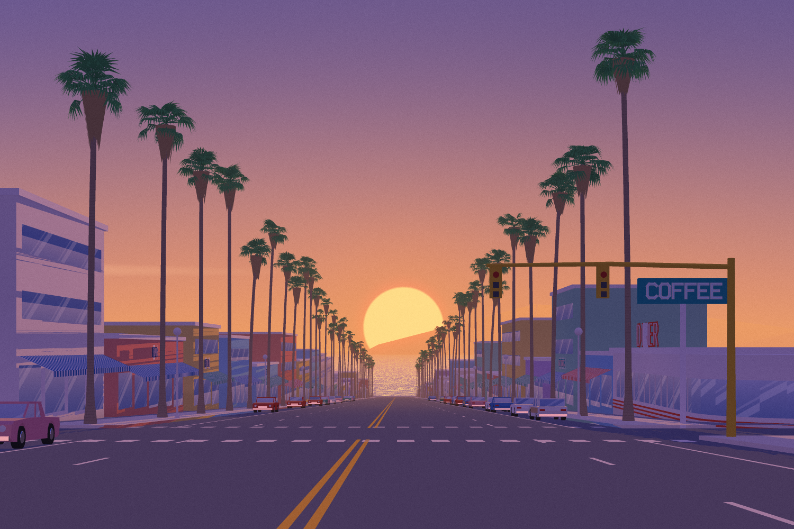
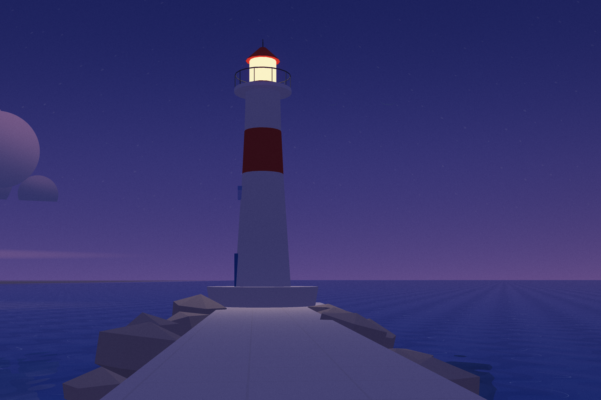
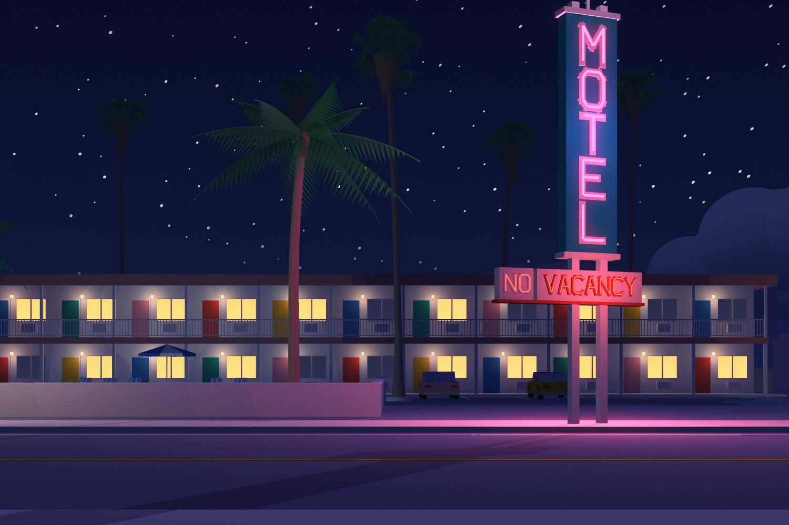
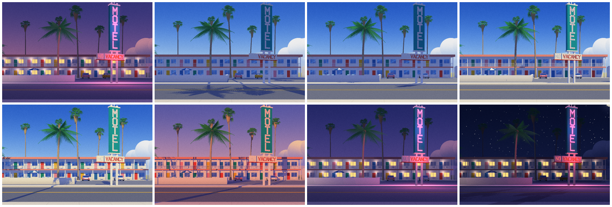

# Paloma Bay

*A seaside town painted by a from-scratch software renderer, one picture at a time.*

A motel on the coast highway, a boulevard laid out on the midsummer sunset, a beach with a lifeguard tower and a pier, a house on the point, and a marina with a lighthouse. It's all grown from rules and painted by an engine written for this project, in homage to the sunlit, deserted resort paintings of Hiroshi Nagai. No images, textures, models or rendering libraries are used. Every pixel comes from the code in `src/`.


- **Visit the town:** [`docs/index.html`](docs/index.html) ([live](https://patelnilay251.github.io/musical-bassoon/docs/)). Full screen, one picture at a time, nothing else on it. Drag across the painting to pass the day. `←` `→` go to another place and `↑` `↓` to another view of it; on a phone, tap the edges or flick up and down. `Space` lets the day go by on its own. The page opens wherever the visitor happens to be at your local time.
- **The book:** [`docs/book.html`](docs/book.html). *Wish You Were Here*: ten postcards from one summer day, sent by someone who never appears in any of them.
- **The workshop:** [`docs/workshop.html`](docs/workshop.html). The first viewer, with all its knobs, for the house alone.
- **The idea behind it:** [`PHILOSOPHY.md`](PHILOSOPHY.md).

## The visitor

Nobody appears anywhere in town. Someone is visiting, though, and they keep a schedule (`src/visitor.js`). The motel at night. Breakfast at the diner. A morning at the house on the point, with a towel, a book and a glass left by the pool. An afternoon on the beach, with an umbrella over nobody and a surfboard missing from the rack, then back again on the sand. At six the red sloop's slip at the marina is empty. The site and the book read the same schedule. Scrub the day on the site and you can follow the yellow convertible around town.

## Wish You Were Here

| | | | | |
|---|---|---|---|---|
|  |  |  |  |  |
| 4:51 a.m. | 8:18 a.m. | 9:48 a.m. | 11:36 a.m. | 2:12 p.m. |
|  |  |  |  |  |
| 4:12 p.m. | 6:06 p.m. | 6:48 p.m. | 7:27 p.m. | 10:00 p.m. |

## One place, one day

The sun follows its real path over 34° north in late July. The palette, the shadows, the sea glitter and the lights all follow from the hour. Neon burns until sunrise, and the NO in NO VACANCY comes on after half past eight.



## Painted, not rendered

The first version rendered a resort. This one tries to paint a town, the way an illustrator with an airbrush would:

- **Light is chosen, not simulated.** Each moment of the day names a light tone and a shade tone, keyed to the sun's elevation. Planes take one of three lit values (full, oblique, grazing) instead of a continuous falloff. Walls are airbrushed lighter toward the top in sun and warmer near the ground in shade, and curved forms get a soft terminator and a sprayed sheen. Shadows are a change of hue, periwinkle and violet, not a loss of it.
- **Skies are sprayed in layers:** an ultramarine ground, white mist from the horizon, blue laid back over it and deepening toward the top of the frame, and never quite even. Cumulus clouds live on the sky dome as crowns of puffs in paint order, lit as one airbrushed form with a flat, shaded base.
- **Glass and water are painted the way painters paint them.** Windows get deep blue at the foot of each floor, lifting toward the sky's color, with diagonal bands of reflected light. Water mirrors the world through a second camera, then gets marbled bands and broken white crest lines. Beaches fade from aqua over the sand to deep blue offshore, with foam drawn as tapered strokes.
- **Verticals stay vertical.** Every composition is built level, like a view camera, and a lens shift puts the horizon where the picture wants it (`src/camera.js`). Taller screens keep the width of the view and gain sky. Long lenses flatten the perspective.
- **Finish:** neon and lamps burn past white, and a glow pass lets them bleed. A fine grain, strongest in the midtones, stands in for the tooth of acrylic on board.

## How it works

**Rasterizer** (`src/raster.js`). Triangles are clipped against the near plane and rasterized with edge functions into a visibility buffer: for each sample, the nearest triangle's id and depth. Shading runs once per visible sample, afterwards, so overdraw is nearly free. Frames render in 64-pixel tiles with supersampling.

**Shadows** (`src/bvh.js`). An orthographic sun shadow map, read with PCF. For print, the map only classifies: where a 4×4 neighborhood agrees, its answer stands, and everywhere else a ray is traced through a bounding volume hierarchy, which gives exact edges for a fraction of the cost.

**Reflections.** Everything above the water is rendered a second time from a camera mirrored in its surface, then looked up along the ripple-perturbed reflected ray. Pools limit that pass to their rectangle. For open water under a level camera, row *y* of the frame only ever sees mirrored row *−y − 2·shift*. So only a band of the mirror is rendered, and a test proves the picture doesn't change by a single bit.

**The town** (`src/scenes/`, `src/world/`). A transform-stack mesh builder (boxes, prisms, extruded profiles, tubes, spheres) feeds the rules for each place:
- a motel block with walkways, pickets and colored doors;
- a pylon sign with stacked channel letters in a stroke font, neon laid in every stroke;
- Mexican fan palms with skirts and split, drooping fan leaves, and coconut palms with folded leaflets;
- cars in three bodies;
- hulls lofted from stations, with sheer, flare and overhangs, then rigged as sloops or built up into motor yachts;
- a lighthouse, a rock breakwater, a pier on pilings, a lifeguard tower, and a streamline diner with a rounded end.

The boulevard is built in a road frame and turned onto the sunset bearing. Every place has a fixed seed and independent random streams, so the things the visitor leaves behind never reshuffle the town.

**The site** (`web/`). The whole engine is bundled into a Web Worker and inlined into one HTML file. A pool of workers paints each frame from the middle out. While you drag, it's a quick sketch at a fraction of the resolution. Once you let go, the finished picture comes in tile by tile over the sketch, and the glow is laid on at the end. Places crossfade. Without workers, the same service runs on the page one tile per task.

## Running it

Node 22 or newer. `npm install` brings in esbuild, which is used only to bundle the site.

```sh
npm test                 # engine, world rules, the town, the visitor, the lens, the mirror band, the render service
npm run build            # docs/index.html (the town) and docs/workshop.html (the old viewer)
npm run book             # the postcards, in parallel on every core, into docs/book/ and docs/book.html
npm run gallery          # the contact sheets above
npm run render -- --place marina --view slips --time 15.8 --w 1500 --h 1000 --ss 3 --rays --out docks.png
```

`node scripts/book.js --inline book.html` writes a single self-contained copy of the book with the images embedded. A 1500×1000 postcard with 9 samples per pixel and exact shadows takes 8 to 19 seconds on one core, and the whole book about 40 seconds on four.

## Notes

- The style is an homage. No artwork was copied or used as input; the look comes from rules written in code.
- Geometry ranges from about 32,000 triangles (the house) to 145,000 (the boulevard, which has 128 palms on it).
- `PHILOSOPHY.md` is the brief the engine was built against.
